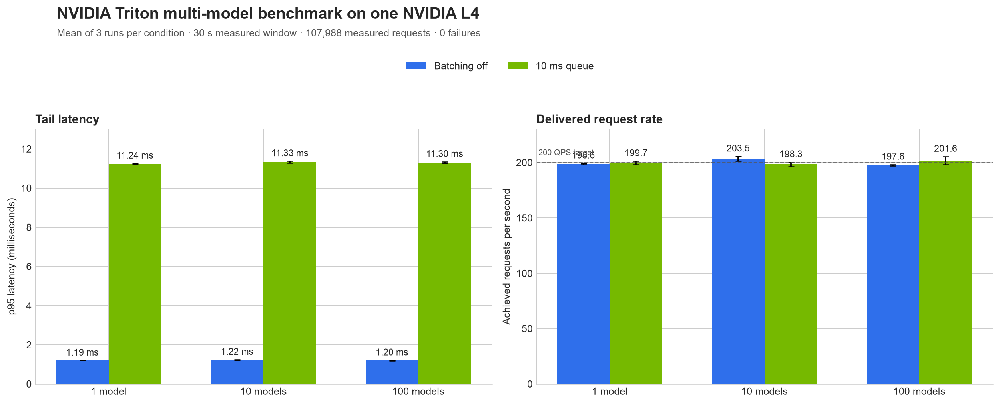

# Triton Multi-Model Benchmark


## What this project did — in plain English

An AI application may need to keep many models ready at once. This project tested whether one cloud GPU could serve **100 small prediction models at the same time** while answering requests quickly and reliably.

I built a repeatable test system, ran it on an NVIDIA L4 GPU, sent roughly 200 prediction requests per second across 1, 10, and 100 models, and compared immediate processing with a 10 ms waiting window that groups requests together. All 18 test runs passed. With 100 models and no waiting window, 95% of requests finished within **1.20 ms**, and no measured request failed.

The practical finding: at this traffic level, waiting to form batches made responses about **9.4× slower** without a meaningful change in the delivered request rate. The detailed method, limitations, and evidence are below.



## Headline results

- **107,988 measured requests**, with **0 failures** across 18 valid runs.
- **100 models:** 197.6 achieved QPS and **1.20 ms p95 latency** with batching off.
- **Stable consolidation:** p95 latency stayed near 1.2 ms from 1 to 100 loaded models when batching was off.
- **Batching trade-off:** a 10 ms queue increased overall mean p95 latency from 1.20 ms to 11.29 ms, while both policies delivered about 199.9 QPS.
- **GPU memory:** mean observed allocation grew from about 282 MiB for 1 model to 2,391 MiB for 100 models.

These are results for this workload—not a claim about every model or the L4's maximum capacity. The benchmark used small synthetic tree models, one request rate, and a load generator on the same machine as Triton.

## Results table

Each value is the mean of three 30-second measured runs. Where shown, `±` is the sample standard deviation between repetitions.

| Loaded models | Batching policy | Achieved QPS | p50 latency | p95 latency | p99 latency | Failed requests |
|---:|:---|---:|---:|---:|---:|---:|
| 1 | Off | 198.6 ± 0.6 | 0.92 ms | 1.193 ± 0.003 ms | 1.48 ms | 0 |
| 1 | 10 ms queue | 199.7 ± 1.5 | 6.75 ms | 11.237 ± 0.019 ms | 11.53 ms | 0 |
| 10 | Off | 203.5 ± 2.1 | 0.92 ms | 1.220 ± 0.015 ms | 1.53 ms | 0 |
| 10 | 10 ms queue | 198.3 ± 2.0 | 10.96 ms | 11.325 ± 0.048 ms | 11.65 ms | 0 |
| 100 | Off | 197.6 ± 0.6 | 0.90 ms | 1.196 ± 0.008 ms | 1.51 ms | 0 |
| 100 | 10 ms queue | 201.6 ± 3.7 | 10.97 ms | 11.302 ± 0.038 ms | 11.61 ms | 0 |

The machine-readable version is [results/portfolio-summary.csv](results/portfolio-summary.csv).

## What the terms mean

- **NVIDIA Triton Inference Server** is software that keeps trained models available and handles prediction requests.
- **QPS** means queries per second: how many requests were completed each second.
- **p95 latency** is the response time that 95% of requests beat. It exposes slow-tail behavior better than an average alone.
- **Dynamic batching** briefly holds requests so Triton can process a group together. This can improve throughput under heavier load, but the waiting time can hurt latency when traffic is modest.
- **Multi-model serving** means one server and GPU host many independently addressable models instead of dedicating a machine to each one.

## Experiment design

| Item | Value |
|:---|:---|
| GPU | NVIDIA L4, 23,034 MiB VRAM |
| Platform | RunPod Secure Cloud, EUR-IS-1 |
| Server | NVIDIA Triton 25.06, ONNX Runtime backend |
| Model counts | 1, 10, and 100 |
| Traffic | Deterministic Poisson arrivals, 200 target QPS, uniform model selection |
| Batching policies | Off and 10,000 μs maximum queue delay |
| Repetitions | 3 per condition; 18 runs total |
| Timing | 5-second warm-up + 30-second measured window per run |
| CPU isolation | Triton on CPUs 0–7; load generator on CPUs 8–12 |
| Container | Immutable image digest `sha256:50087af8c9182b01fd1d45c6c4c7d77fffe0c321f2e6829b49d48a0add3cccbb` |
| Benchmark commit | `0c40a1fda6bc6bd2989f07d8daada8906fdd3efc` |

The runner sends asynchronous gRPC requests, records every request, excludes warm-up traffic from reported metrics, and captures one-second GPU and Triton-process telemetry. It restarts Triton between model-count/batching groups and pins the server and load generator to disjoint CPU sets.

## Evidence and reproducibility

The reviewed benchmark archive is in [evidence/runpod/2026-10-02-l4-portfolio-benchmark](evidence/runpod/2026-10-02-l4-portfolio-benchmark). It contains:

- [the immutable matrix manifest](evidence/runpod/2026-10-02-l4-portfolio-benchmark/results/portfolio-benchmark/matrix-manifest.json);
- [18 per-run summaries](evidence/runpod/2026-10-02-l4-portfolio-benchmark/results/portfolio-benchmark/summaries);
- [raw per-request records](evidence/runpod/2026-10-02-l4-portfolio-benchmark/results/portfolio-benchmark/raw);
- [GPU telemetry](evidence/runpod/2026-10-02-l4-portfolio-benchmark/results/portfolio-benchmark/gpu), [CPU/RSS telemetry](evidence/runpod/2026-10-02-l4-portfolio-benchmark/results/portfolio-benchmark/cpu), and [Triton server logs](evidence/runpod/2026-10-02-l4-portfolio-benchmark/results/portfolio-benchmark/server);
- [the validation report](evidence/runpod/2026-10-02-l4-portfolio-benchmark/results/portfolio-benchmark/VALIDATION.txt) and [SHA-256 checksums](evidence/runpod/2026-10-02-l4-portfolio-benchmark/results/portfolio-benchmark/SHA256SUMS); and
- [the recorded hardware and runtime environment](evidence/runpod/2026-10-02-l4-portfolio-benchmark/environment.txt).

All 83 files covered by `SHA256SUMS` were verified again after they were copied from the Pod. The Pod was then terminated, and the account was verified to have zero running Pods and zero network volumes.

## Interpretation and limitations

This is a controlled single-node microbenchmark. The client and server shared the same host, so the numbers do not include internet latency. The models are small synthetic XGBoost regressors exported to ONNX; larger neural networks will behave differently. The experiment held traffic at 200 target QPS, so it measures behavior at that operating point rather than maximum throughput.

The one-second `nvidia-smi` samples reported 0% utilization. Short GPU work bursts can fall between samples at this interval, so those readings should not be interpreted as proof that the GPU did no work. Memory readings were stable and useful; a follow-up saturation study should use higher request rates and finer-grained GPU profiling.

## Resume-ready summary

- Built a reproducible NVIDIA Triton benchmarking harness with deterministic asynchronous gRPC load generation, CPU affinity isolation, telemetry capture, immutable container provenance, resumable runs, and checksum-verified evidence.
- Benchmarked 1–100 concurrently loaded ONNX models on an NVIDIA L4 across 18 controlled runs and 107,988 measured requests; sustained about 200 QPS with zero failures and 1.20 ms p95 latency at 100 models.
- Quantified the batching trade-off at 200 QPS: a 10 ms queue increased mean p95 latency 9.4× without a measurable delivered-throughput gain.

## Reproduce the project

Start with [RUNBOOK.md](RUNBOOK.md). It covers local setup, deterministic model generation, the digest-pinned Pod image, strict SSH verification, the preflight gate, result mirroring, validation, and teardown.

Generate and validate the model zoo locally:

```bash
source .venv/bin/activate
python scripts/gen_models.py --count 100 --seed 20260805
python scripts/validate_models.py --count 100
```

## Repository layout

```text
configs/            Experiment definitions
evidence/           Validated RunPod archive, raw records, telemetry, and logs
model_repository/   Reproducibly generated Triton model repository
results/            Aggregated data and publication-ready charts
scripts/            Model generation, load generation, mirroring, and runners
tests/              Automated unit and integration checks
triton_benchmark/   Benchmark implementation
```
